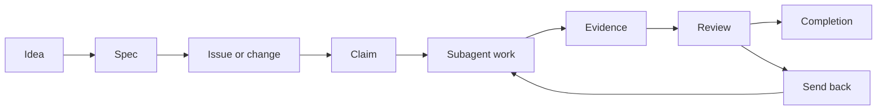

# agent-hub-skills

Reusable Codex skills and deterministic scripts for coordinating repo-native,
multi-agent work with Agent Hub v3.

Agent Hub v3 is a lightweight project operating system for agentic software
work. A target repository owns a `.hub/` directory, and that directory is the
durable source of truth for the project: issues, changes, decisions, evidence,
reports, reviews, and archived history all live there. Chat transcripts,
subagent memories, and optional Notion mirrors are helpful context, but they are
not authoritative for repo work.

## Core Model

Agent Hub v3 separates deterministic state changes from agent judgment.

- `.hub/` stores durable project state in the repository where work happens.
- Deterministic CLI commands and scripts own `.hub` structure and mutation:
  frontmatter, links, dependencies, statuses, claims, evidence appends, reports,
  and archive moves.
- Skills are thin routing and policy layers. They decide which command or
  workflow to use, assemble bounded handoffs, and enforce readiness and review
  gates.
- Substantive work is subagent-first. Implementation, research, review, audit,
  analysis, QA, and documentation drafting should be delegated to bounded
  subagents with explicit scope, permitted edits, validation, evidence, and stop
  conditions.
- Implementation is TDD-first and regression-first. Before code changes, create
  or identify the first failing deterministic test, fixture eval, or agentic
  scenario eval, or record a durable automated-test exception with rationale.
- Review is evidence-based. Completion requires durable evidence for done
  criteria, regression coverage or exception, final verification, and PR or
  commit metadata when repo files changed.

Use Notion only for legacy hubs or optional personal mirrors. Treat a mirror as
stale until the local `.hub` record agrees with it.

## `.hub/` Layout

A v3 hub is initialized inside the target repository:

```text
.hub/
|-- config.yml
|-- state.yml
|-- .gitignore
|-- project/
|   |-- principles.md
|   |-- product.md
|   |-- tech.md
|   |-- structure.md
|   |-- standards-index.md
|   `-- delegation.md
|-- changes/
|   `-- <change-slug>/
|       |-- change.yml
|       |-- proposal.md
|       |-- shape.md
|       |-- design.md
|       |-- tasks.md
|       |-- checklist.md
|       |-- evidence.md
|       `-- review.md
|-- issues/
|   `-- <issue-id>.md
|-- decisions/
|-- reports/
|   |-- latest-audit.json
|   |-- latest-audit.md
|   |-- latest-analysis.json
|   `-- latest-analysis.md
|-- artifacts/
`-- runtime/
```

`.hub/runtime/` stores live claim locks and must remain local:

```gitignore
runtime/
```

## CLI And Scripts

Prefer the installed `agent-hub` command when available. During development, use
the repo-local script:

```bash
python3 skills/manage-agent-hub-issues/scripts/agent_hub.py --repo <target-repo> ...
```

The v3 command surface owns durable writes:

```bash
agent-hub init
agent-hub state refresh
agent-hub change create
agent-hub change link-issue
agent-hub change archive
agent-hub issue create
agent-hub issue add-dependency
agent-hub issue remove-dependency
agent-hub issue set-status
agent-hub issue append-activity
agent-hub issue add-evidence
agent-hub claim acquire
agent-hub claim check
agent-hub claim renew
agent-hub claim release
agent-hub audit hub
agent-hub audit issue <issue-id>
agent-hub analyze change <change-slug>
agent-hub scenario eval <scenario-path>
```

Older leaf scripts remain compatibility wrappers for operations they already
support. If no deterministic command exists for a requested `.hub` mutation,
stop and add the missing backend surface instead of hand-editing frontmatter,
claims, dependencies, status, reports, archives, or layout.

## Skill Map

Primary resolver:

- `manage-agent-hub-issues`: main router and shared policy surface for v3
  orchestration, deterministic writes, subagent-first execution, TDD gates,
  review invariants, and legacy Notion compatibility.

Setup and configuration:

- `init-agent-hub`: initializes a repo-native `.hub/` layout, or a legacy Notion
  hub only when explicitly requested.
- `setup-agent-hub`: configures local Notion credentials and default legacy hub
  metadata.

Issue and change lifecycle:

- `create-agent-hub-issue`: creates issues, changes, follow-ups, decisions, open
  questions, handoffs, and dependency links through deterministic surfaces.
- `spec-agent-hub-issue`: turns rough ideas or vague issues into agent-ready
  specs with scope, out of scope, done criteria, verification strategy, and
  regression target.
- `list-agent-hub-issues`: lists and filters work without mutating state,
  including dependency-aware readiness views.
- `claim-agent-hub-issue`: acquires, checks, renews, and releases optimistic
  leases for work or review.
- `update-agent-hub-issue`: appends progress, blockers, handoffs, repo metadata,
  evidence, review submissions, and release notes after work starts.

Execution:

- `iterate-agent-hub-work`: starts one bounded iteration by listing ready work,
  spawning up to 10 subagents, and returning their IDs without waiting for
  completion.

Review and audit:

- `review-agent-hub-issue`: independent review gate for `In Review` work before
  completion.
- `review-agent-hub-workspace`: audits workspace hygiene, readiness, stale
  claims, evidence gaps, vague issues, unhealthy reviews, and change consistency.

Maintenance:

- `sync-agent-hub-skills`: syncs installed local Agent Hub skills back to this
  repository, validates them, commits, and pushes.
- `dry-mece`: supporting reasoning skill for DRY and MECE decomposition,
  documentation, planning, critique, and review.

## Lifecycle



The practical flow:

1. Capture the idea as a spec or change packet.
2. Create claimable issues with scope, out of scope, done criteria,
   verification, and dependencies.
3. Claim only ready work: `Not Started`, unowned, unblocked, no unexpired claim,
   dependencies complete or explicitly waived, and verification clear.
4. Delegate substantive work to bounded subagents.
5. Record activity and evidence with deterministic append commands.
6. Submit for review only after done criteria, verification, regression
   evidence or exception, commit SHA, pushed branch, and PR URL are recorded.
7. Review from durable `.hub` records, PRs, commits, artifacts, and command
   output. Completion is a review decision, not a manual status edit.

## Practical Examples

Initialize a hub in a target repo:

```bash
agent-hub --repo /path/to/repo init --project-name "Example Project"
agent-hub --repo /path/to/repo state refresh
```

Equivalent development command:

```bash
python3 skills/manage-agent-hub-issues/scripts/agent_hub.py \
  --repo /path/to/repo \
  init --project-name "Example Project"
```

Create a change packet and link an issue:

```bash
agent-hub --repo /path/to/repo change create \
  --slug checkout-retry \
  --title "Add checkout retry handling" \
  --priority P1

agent-hub --repo /path/to/repo issue create \
  --id hub-123 \
  --title "Implement checkout retry regression coverage" \
  --type Feature \
  --priority P1 \
  --change checkout-retry
```

Claim ready work for a bounded subagent:

```bash
agent-hub --repo /path/to/repo claim acquire \
  --issue hub-123 \
  --purpose work \
  --owner codex-subagent-1 \
  --claim-id hub-123-codex-subagent-1 \
  --base-branch main \
  --branch codex/hub-123-checkout-retry \
  --worktree-path /path/to/worktrees/hub-123
```

Append progress and evidence:

```bash
agent-hub --repo /path/to/repo issue append-activity \
  --issue hub-123 \
  --heading "Progress" \
  --line "Created failing regression test for duplicate checkout retries."

agent-hub --repo /path/to/repo issue add-evidence \
  --issue hub-123 \
  --heading "Verification" \
  --line "python3 -m unittest tests.test_checkout_retry: passed"
```

Audit a hub, audit one issue, and analyze a change packet:

```bash
agent-hub --repo /path/to/repo audit hub
agent-hub --repo /path/to/repo audit issue hub-123
agent-hub --repo /path/to/repo analyze change checkout-retry
```

Reports are written to `.hub/reports/` as JSON for stable diagnostics and
Markdown for humans.

## Install

Install these skills with Codex's `skill-installer`:

```bash
python3 ~/.codex/skills/.system/skill-installer/scripts/install-skill-from-github.py \
  --repo jcpinto54/notion-agent-hub-skills \
  --path \
  skills/dry-mece \
  skills/setup-agent-hub \
  skills/manage-agent-hub-issues \
  skills/init-agent-hub \
  skills/create-agent-hub-issue \
  skills/spec-agent-hub-issue \
  skills/list-agent-hub-issues \
  skills/claim-agent-hub-issue \
  skills/iterate-agent-hub-work \
  skills/update-agent-hub-issue \
  skills/review-agent-hub-issue \
  skills/review-agent-hub-workspace \
  skills/sync-agent-hub-skills
```

Restart Codex after installing or updating skills.

## Development, Tests, And Evals

Run the deterministic unit tests:

```bash
python3 -m unittest discover -s tests
```

Run all current evals:

```bash
python3 evals/run_evals.py
```

Run one scenario eval through the v3 CLI:

```bash
python3 skills/manage-agent-hub-issues/scripts/agent_hub.py \
  scenario eval evals/scenarios/resolver-routes-mutations.json
```

Validate skill metadata:

```bash
for skill in skills/*; do
  python3 ~/.codex/skills/.system/skill-creator/scripts/quick_validate.py "$skill"
done
```

Recommended documentation checks:

```bash
git diff --check -- README.md
LC_ALL=C rg -n "[^[:ascii:]]" README.md || true
```
