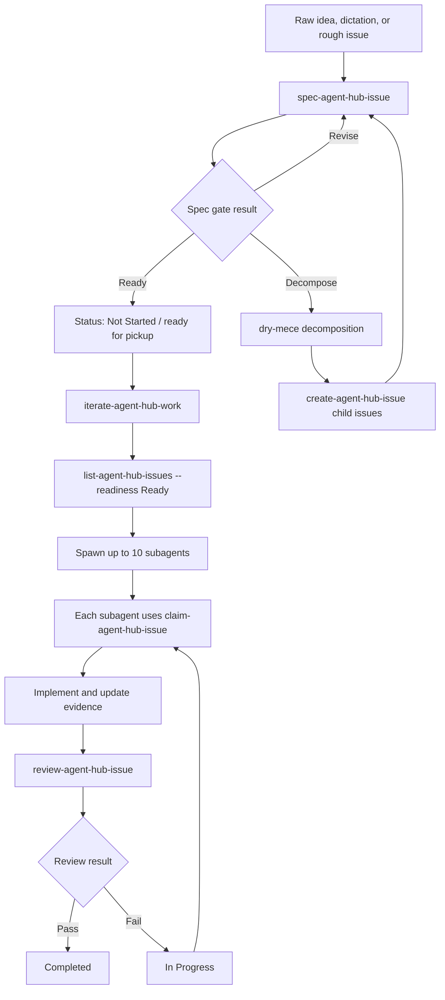
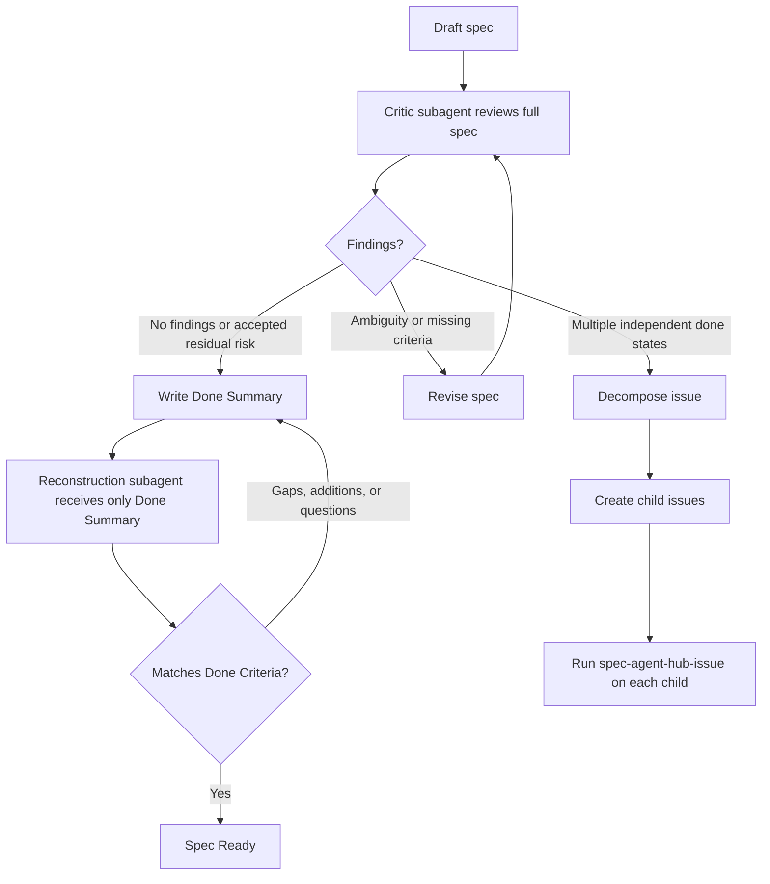

# agent-hub-skills

Reusable Codex skills for coordinating multi-agent work in a Notion Agent Hub.

The suite keeps automation intentionally small:

- `dry-mece` provides generic DRY and MECE reasoning context for code, planning, research, docs, and skill design.
- `setup-agent-hub` validates and stores Agent Hub configuration.
- `list-agent-hub-issues` lists hub issues and computes readiness through the Notion API.
- `spec-agent-hub-issue` turns raw ideas or rough issues into agent-ready specs before parallel execution.
- `claim-agent-hub-issue` manages optimistic ownership leases for work and review.
- `iterate-agent-hub-work` spawns subagents for one ready-issue iteration without redefining readiness or claim rules.
- `sync-agent-hub-skills` copies installed Agent Hub skills back to the repo, validates, commits, and pushes.
- The remaining skills guide creation, updates, review decisions, and workspace hygiene through Notion MCP and durable issue records.

## Parallel Agent Workflow

Parallel execution is only useful after issues are small, clear, and independently verifiable. Use `spec-agent-hub-issue` before `iterate-agent-hub-work` to turn raw ideas into ready issues or split work that is too broad for one agent.



The spec gate uses fresh-context checks before an issue can enter the parallel queue:



## Install

After publishing this repository to GitHub, install the skills with Codex's `skill-installer`:

```bash
python3 ~/.codex/skills/.system/skill-installer/scripts/install-skill-from-github.py \
  --repo jcpinto54/notion-agent-hub-skills \
  --path \
  skills/dry-mece \
  skills/setup-agent-hub \
  skills/manage-agent-hub-issues \
  skills/init-agent-hub \
  skills/create-agent-hub-issue \
  skills/spec-agent-hub-issue \
  skills/list-agent-hub-issues \
  skills/claim-agent-hub-issue \
  skills/iterate-agent-hub-work \
  skills/update-agent-hub-issue \
  skills/review-agent-hub-issue \
  skills/review-agent-hub-workspace \
  skills/sync-agent-hub-skills
```

Restart Codex after installing.

## Development

Run unit tests:

```bash
python3 -m unittest discover -s tests
```

Validate skill metadata:

```bash
for skill in skills/*; do
  python3 ~/.codex/skills/.system/skill-creator/scripts/quick_validate.py "$skill"
done
```
